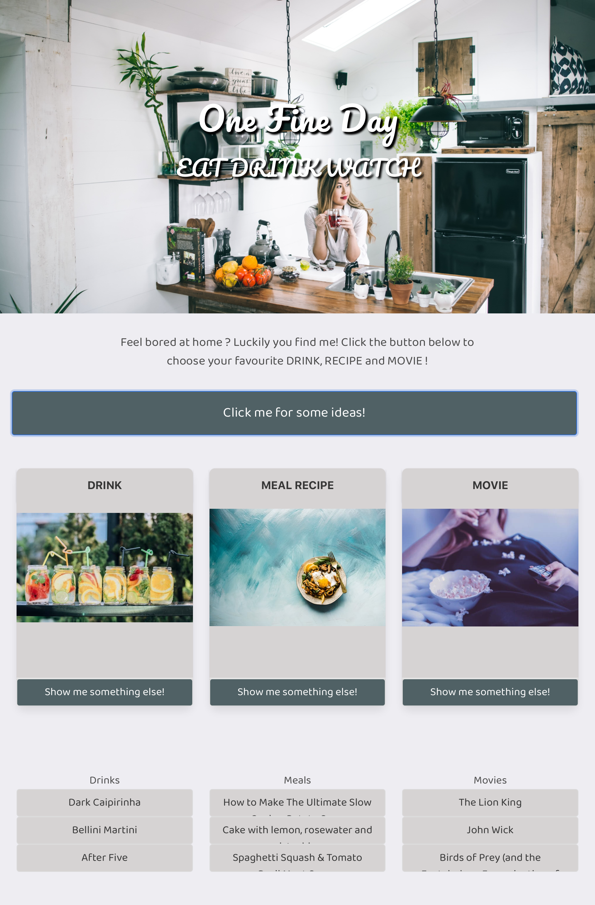

# Project Title: One Fine Day

## Overview

Create an app that provide user a range of choices on drink, recipe and movie.\
User can either randomize the choices combination or save as preference.

## Usage

Deployed app: <https://rehamilton.github.io/One-Fine-Day/>\
Repo link: <https://github.com/rehamilton/One-Fine-Day>

## User Story

As a user\
I want to browser a range of choice on drink, recipe and movie\
So I can make choice on how to spend my "One Fine Day"!

## Acceptance Criteria

GIVEN the web open\
WHEN I click on "Click me for some ideas!" button\
THEN drink, recipe and movie cards will be updated with random content\
WHEN I click on "show me something else!" button at any card\
THEN only the selected card content will be updated with random content\
WHEN I click on the history buttons below card\
THEN the three choices will saved as user preference and display in the card content

## API used

thecocktaildb <https://www.thecocktaildb.com/api>\
spoonacular <https://spoonacular.com>\
TMDB <https://www.themoviedb.org/documentation/api>

## Application Requirements

- Must use at least two server-side APIs
- Must use a CSS framework other than Bootstrap
- Must be interactive (i.e: accept and respond to user input)
- Use at least one new third-party API
- Must have a polished UI
- Must meet good quality coding standards
- Does not use alerts, confirms or prompts (look into modals)
- Must be deployed to GitHub Pages
