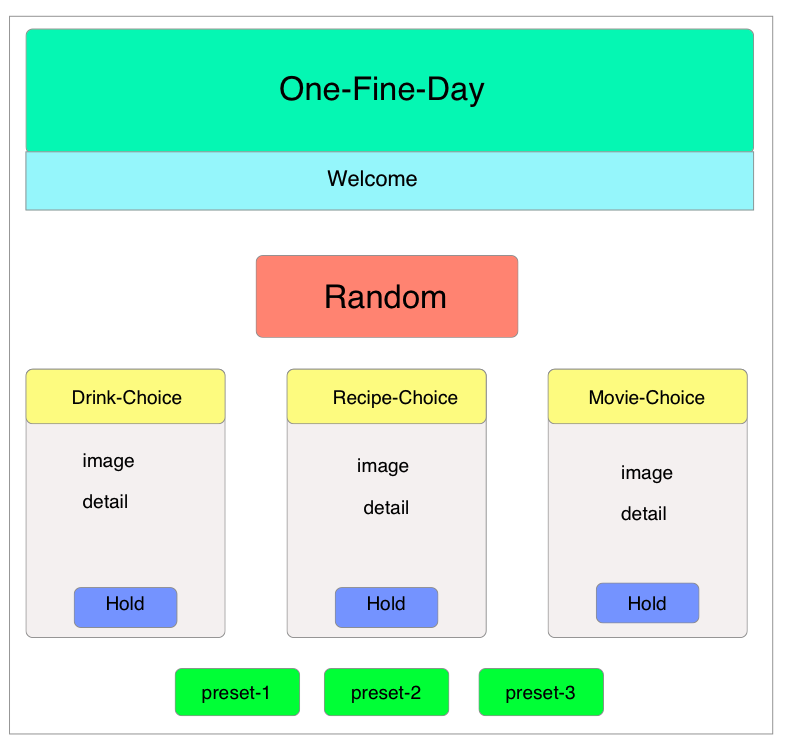

## Project Title: One Fine Day

## Milestone

- Project presentation by 30/03/2020

## Overview

Create an app that provide user a range of choices on drink, recipe and movie.
User can either randomize the choices combination or save as preference.

## Usage

- Deployed app: <https://rehamilton.github.io/One-Fine-Day/>
- Repo link: <https://github.com/rehamilton/One-Fine-Day>

## User Story

- As a user
- I want to browser a range of choice on drink, recipe and movie.
- So I can make choice on how to spend my "One Fine Day"!

## Acceptance Criteria

- GIVEN the web open
- WHEN I click "Random" button
- THEN drink, recipe and movie cards will be updated with random content
- WHEN I click "Hold" button at any card
- THEN the hold card content won't change
- WHEN I click "preset" button
- THEN the three choices will saved as user preference and display in the card content

## Wire Frame

## API used

BreweryDB <https://www.brewerydb.com>
spoonacular <https://spoonacular.com>
OMDB <https://www.omdbapi.com>

## Task Breakdown

- Brainstorming initial concept (mvp)
- Research API's and get keys
- test keys to ensure they provide the right info
- review and choose css framework
- Basic HTML
- style html
- test keys
- write script
- test script
- test full website
- end user testing
- move mvp to production
- Recipe's and beers (add on if mvp goes well)
- add option for recipe's and drink suggestions if user wants to stay in
- add html
- style html
- write script
- test script and website
- end user testing
- move second stage to production

## Application Requirements

- Must use at least two server-side APIs
- Must use a CSS framework other than Bootstrap
- Must be interactive (i.e: accept and respond to user input)
- Use at least one new third-party API
- Must have a polished UI
- Must meet good quality coding standards
- Does not use alerts, confirms or prompts (look into modals)
- Must be deployed to GitHub Pages
